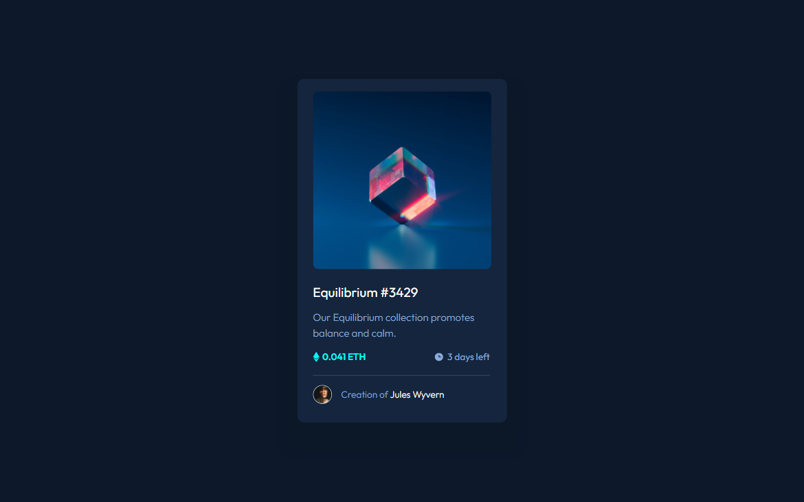
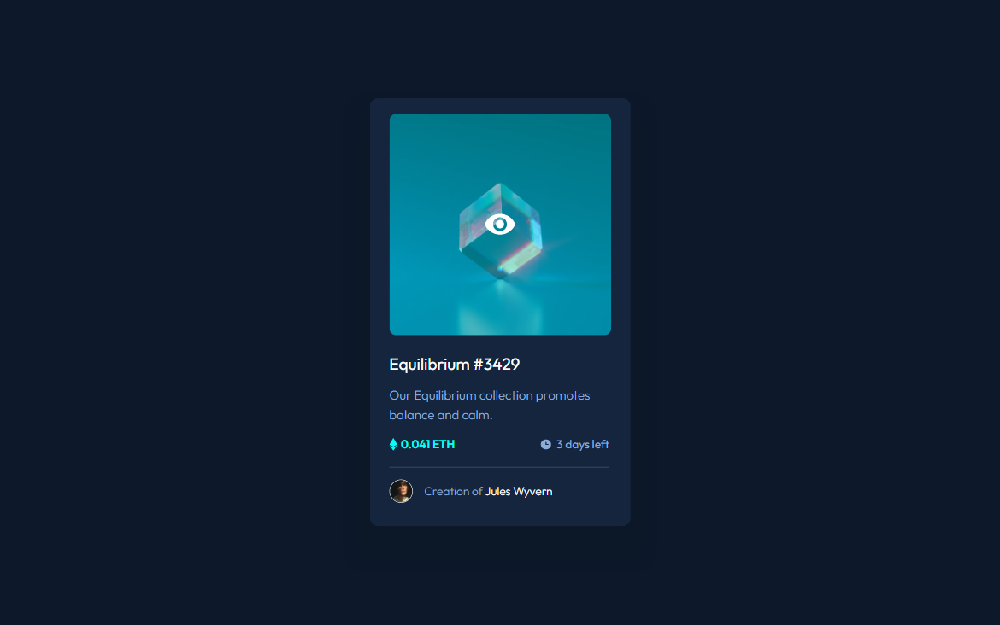
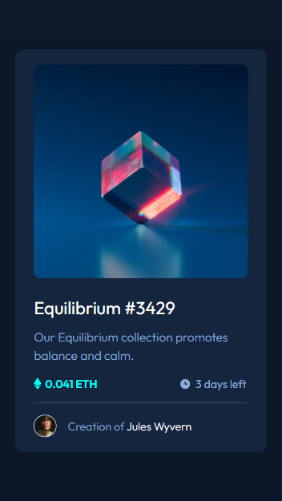

# Frontend Mentor - NFT preview card component solution

This is a solution to the [NFT preview card component challenge on Frontend Mentor](https://www.frontendmentor.io/challenges/nft-preview-card-component-SbdUL_w0U).

## Table of contents

- [Overview](#overview)
  - [The challenge](#the-challenge)
  - [Screenshot](#screenshot)
  - [Links](#links)
- [My process](#my-process)
  - [Built with](#built-with)
  - [What I learned](#what-i-learned)
  - [Continued development](#continued-development)
  - [Useful resources](#useful-resources)
- [Author](#author)

**Note: Delete this note and update the table of contents based on what sections you keep.**

## Overview

### The challenge

Users should be able to:

- View the optimal layout depending on their device's screen size
- See hover states for interactive elements

### Screenshot

### Links

- Live Site URL: [Here](https://gc12-nft-preview.netlify.app)

## My process

### Built with

- Semantic HTML5 markup
- CSS custom properties
- Flexbox
- Mobile-first workflow
- BEM

### What I learned

- I chose to do this project because I wanted to know how to implement the hover state for the image.

- I learned that I can do the cyan color by using an ::after pseudo-element.

  - As a note, I also learned that I should put 'content: ""' for these most if not all of the time.

- Then, the view icon is just absolutely positioned relative to the imagebox. I set the z-index higher so that it would be on top of the background color.

- I also learned that I could implement more than one box-shadow to an element, simply by adding another set of properties separated by a comma.

### Continued development

- I need more practice using pseudo-elements.

### Useful resources

- [This CSS-tricks article](https://css-tricks.com/7-practical-uses-for-the-before-and-after-pseudo-elements-in-css/#:~:text=CSS%20%3A%3Abefore%20and%20%3A%3A,present%20in%20the%20HTML%20content.) showed me how to add an overlay to an image using pseudo-elements.
- [This stackoverflow posting](https://stackoverflow.com/questions/8556604/is-there-a-way-to-use-two-css3-box-shadows-on-one-element) taught me about using multiple box-shadows to one element.

## Author

- Frontend Mentor - [@GioCura](https://www.frontendmentor.io/profile/GioCura)
